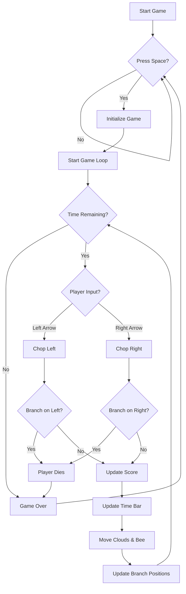

# Timber Game

A 2D arcade-style game built with SFML where you play as a woodcutter chopping a tree while avoiding branches.

## Description

Timber is an action game where you control a woodcutter who must chop down a tree while avoiding being squished by branches. The game features:

- Time-based gameplay with a shrinking time bar
- Score tracking system
- Dynamic cloud and bee animations
- Sound effects for chopping and game events
- Randomly generated branch patterns
- Death by branch squishing mechanic

## Controls

- `SPACE` - Start the game
- `LEFT ARROW` - Chop on left side
- `RIGHT ARROW` - Chop on right side
- `ESC` - Exit game

## Gameplay Elements

- **Time Bar**: A red bar that constantly shrinks. Game ends when it runs out.
- **Score**: Increases with each successful chop
- **Tree Branches**: Appear randomly on left or right side
- **Flying Log**: Appears when chopping
- **Clouds & Bees**: Animated background elements
- **Death**: Occurs if player is on same side as a branch

## Building and Running

1. Make sure you have SFML installed
2. Compile using:
```sh
g++ timber.cpp -o timber -lsfml-graphics -lsfml-window -lsfml-system -lsfml-audio
```
3. Run the executable:
```sh
./timber
```

## Required Resources

The game requires the following asset files in the correct directories:

### Graphics
- `graphics/background.png`
- `graphics/tree.png`
- `graphics/branch.png`
- `graphics/cloud.png`
- `graphics/bee.png`
- `graphics/player.png`
- `graphics/axe.png`
- `graphics/log.png`
- `graphics/rip.png`

### Fonts
- `fonts/KOMIKAP_.ttf`

### Sound Effects
- `sound/chop.wav`
- `sound/death.wav`
- `sound/out_of_time.wav`


## Game Flow Chart




## License

This project is licensed under the Apache License 2.0 - see the [LICENSE](LICENSE) file for details.